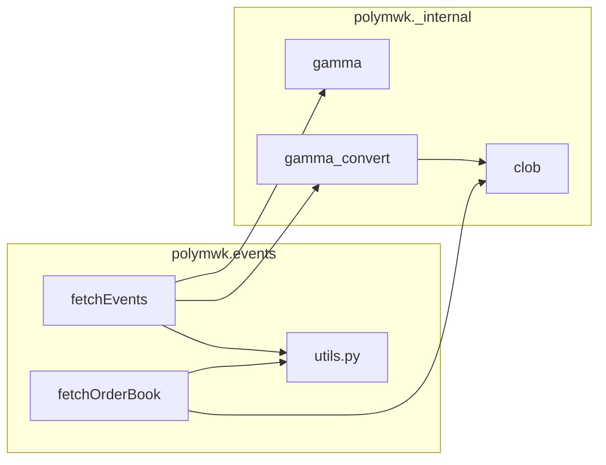
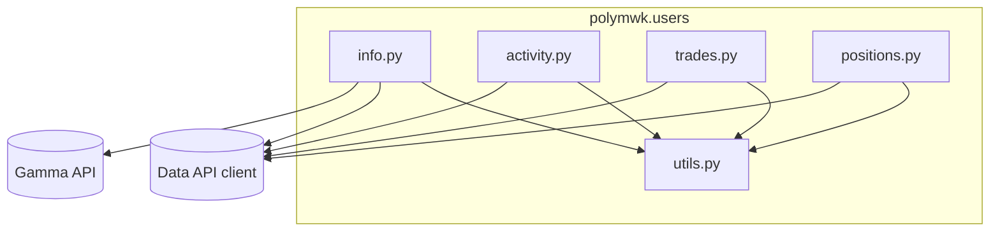

# polymwk architecture

This file lives in **`assets/docs/`** with [USAGE.md](USAGE.md) and [RULES.md](RULES.md). **LLM routing:** [SKILLS.md](../../SKILLS.md) → then these docs for depth.

Python **≥ 3.12** library for **Polymarket** data and terminal-friendly views. The public surface is **`camelCase` functions** and **Pydantic v2 models** in **`polymwk/models.py`**. Vendor HTTP clients and heavy parsing live in **`polymwk/_internal/`** and in per-package **`utils.py`** files.

**[RULES.md](RULES.md)** — naming, `main.py` constraints, and **LLM contributor checklist**.

---

## External systems

| System | Typical role in polymwk |
|--------|-------------------------|
| **Gamma** (`gamma-api.polymarket.com`) | Events, markets, tags, `clobTokenIds`, volumes, **public profiles** (`/public-profile`) |
| **CLOB** (`clob.polymarket.com`) | Order books, midpoints (UI-like Yes/No implied prices per **outcome token**) |
| **Data API** (via `polymarket_apis.PolymarketDataClient`, see `_internal/data.py`) | Positions, closed positions, activity, trades, holders, value, PnL series, leaderboard-style metrics, `/v1/market-positions`, etc. |
| **Other HTTP** (e.g. `lb-api`, `user-pnl-api`) | Used inside **`polymarket-apis`** for some user metrics / PnL (e.g. `get_user_metric`, `get_pnl`) |

**Implied probabilities** on the site align with CLOB **midpoints** on the **Yes token** (first `clobTokenIds` entry). There is no single “event order book”; each outcome token has its own book.

---

## Dependency stack

- **`polymarket-apis`** — Gamma client, CLOB client, **Data client** (`PolymarketDataClient`)
- **`httpx`** — HTTP (including paths the wrappers do not cover cleanly)
- **`pydantic` v2** — all shared DTOs in **`polymwk/models.py`**
- **`polars`** — reserved for heavier tabular workflows (optional future)

---

## Repository map (high level)

```
polymwk/
  __init__.py          # re-exports only
  models.py            # all public Pydantic models
  exceptions.py
  constants.py
  client.py            # Polymarket façade (evolving)
  configs/             # e.g. tags presets
  utils/               # cross-cutting (slug, event query), not per-domain API mapping
  events/              # fetch* for markets/events/order books, comments, holders, …
  displays/            # display* terminal UI — see subfolders below
    utils.py           # shared layout / colors (unchanged)
    events/            # pairs with polymwk.events (listing, orderbook, market*, tags, …)
    users/             # pairs with polymwk.users
    feed/              # pairs with polymwk.feed (e.g. displayLiveOrderBook)
    history/           # scaffold — pairs with polymwk.history
  users/               # fetchUser* (profile, activity, trades, positions)
  _internal/           # gamma, clob, data client singleton, gamma_convert, resolver, …
  feed/                # all subscribe* WebSocket/streaming (nothing live in events/users but fetch*/display*)
  history/             # scaffold — candles, archives, …
```

---

## `polymwk.events` — implemented fetches

| Export | Module | Notes |
|--------|--------|-------|
| `fetchEvents` | `fetch.py` | Tags → Gamma → CLOB mid prefetch → `Event` / `Market` |
| `fetchEvent` | `fetch.py` | One event: **slug** (positional default) or **`id=`** |
| `fetchMarket` | `markets.py` | One market: **slug** (default) or **`id=`** / **`condition_id=`** / **`token_id=`** |
| `fetchMarkets` | `markets.py` | All markets for an event slug or `Event` instance |
| `fetchSeries` | `series.py` | Tag-matched Gamma events → de-dupe embedded / `seriesSlug` series → `Series`, sorted by volume |
| `fetchSerie` | `series.py` | One series: **slug** (positional default) or **`id=`** |
| `fetchOrderBook` | `orderbook.py` | CLOB snapshot → `OrderBook` |
| `fetchMarkets` | `markets.py` | Present; may evolve |
| `fetchEventComments`, … | `event_comments.py`, `market_*.py`, `holders.py`, … | Gamma/Data patterns per feature |

Helpers: **`events/utils.py`** (Gamma params, CLOB → models, market activity from trades, etc.).

---

## `polymwk.users` — implemented fetches

| Export | Module | Upstream (conceptually) |
|--------|--------|-------------------------|
| `fetchUserInfo` | `info.py` | Gamma `public-profile`; Data API for stats / PnL samples; 404 → minimal `UserInfo` |
| `fetchUserLeaderboardRank` | `leaderboard.py` | `lb-api` rank + optional cross metric (`get_user_metric` for volume vs profit) → `UserLeaderboardRank` |
| `fetchUsersLeaderboard` | `leaderboard.py` | Data API `GET /v1/leaderboard` — timeframe + category + `order_by` (PnL/vol) → `UsersLeaderboardSnapshot` |
| `fetchUserActivity` | `activity.py` | `GET /activity` — **limit ≤ 500**, `offset`; optional `side` / `buy_only` / `sell_only`, `condition_id` / `event_id` / `activity_types` / time range; **Yes/No** via `outcome_filter` or `yes_only` / `no_only` (client-side) |
| `fetchUserTrades` | `trades.py` | `GET /trades` — same pagination; `side` / `buy_only` / `sell_only`; **Yes/No** filter client-side like activity |
| `fetchUserPositions` | `positions.py` | `GET /positions` (**active**) or `GET /closed-positions` (**closed**); closed path may return large JSON once, then **client-side `limit` slice** |
| `UserPositionsStatus` | `positions.py` | `Literal["active","closed"]` |

**`users/utils.py`** — `resolve_user_to_proxy_wallet`, handle resolution, **`UserProfile` → `UserInfo`**, Data API row → **`Position`**, **`UserClosedPosition`**, **`Activity`**, **`Trade`**, stats enrichment.

---

## `polymwk.displays` — implemented views

Terminal-oriented **`display*`** functions; shared **`displays/utils.py`** (width, boxed headers, rules, number formatting, colors). Domain slices live under **`displays/events/`**, **`displays/users/`**, **`displays/feed/`**, **`displays/history/`** (scaffold); root **`displays/__init__.py`** re-exports the same public names as before. **`listing.py`** holds `displayEvents` (avoids a module named `events.py` inside the **`displays.events`** package).

| Area | Functions (representative) |
|------|----------------------------|
| Events / markets (`displays/events/`) | `displayEvents`, `displayEvent`, `displayMarket`, `displaySerie`, `displaySeries`, `displayOrderBook`, `displayMarketTopHolders`, `displayMarketLastActivity`, `displayMarketUsersPositions`, `displayEventComments`, market resolution/rules/prices, `displayTags`, … |
| Feed (`displays/feed/`) | `displayLiveOrderBook` (WebSocket; reuses `displays/events/orderbook.displayOrderBook` ladder) |
| Users (`displays/users/`) | `displayUserInfo`, `displayUserLeaderboardRank`, `displayUsersLeaderboard`, `displayUserPositions` (`status` matches active vs closed rows), `displayUserActivity`, `displayUserTrades` |

**Pairing:** `fetchUser*` results are intended to be passed into the matching **`displayUser*`** (`status=` where applicable).

---

## `polymwk.feed` — WebSocket / streaming (scaffold)

**All** live-streaming work is confined to **`feed/`**: public **`subscribe<Module><Action>`** (`camelCase`), e.g. **`subscribeMarketOrderBook`** alongside REST **`fetchOrderBook`** in **`events/orderbook.py`**. **`events/`**, **`users/`**, and **`displays/`** do not grow **`subscribe*`** — only **`fetch*`** / **`display*`** there.

Thin **`feed/<topic>.py`** entry modules, **`feed/utils.py`** for shared parsing and connection helpers; optional non-public **`_internal/websockets.py`** may back `feed/` but must not expose parallel public APIs. Re-export **`subscribe*`** from **`polymwk`** when implemented.

| Export | Module | Notes |
|--------|--------|-------|
| `subscribeMarketOrderBook` | `orderbook.py` | CLOB `wss://ws-subscriptions-clob.polymarket.com/ws/market` — callbacks receive `OrderBook` / `OrderBookUpdate`; blocks until the socket ends |

---

## Data flow diagrams

### Events + order book (simplified)



### Users (simplified)



---

## Pipelines (reference)

### Event fetch

1. **`fetchEvents`** builds Gamma filters (e.g. active + `closed=False` when `status="active"`).
2. Raw Gamma events → **`gamma_convert`** prefetches **Yes `token_id`** mids from CLOB.
3. **`gamma_event_to_polymwk`** builds **`Event`** / **`Market`** with `yes_token_id` / `no_token_id` from Gamma.

### Order book

1. **`fetchOrderBook`** calls CLOB `get_order_book` (optional slug/condition resolution).
2. **`order_book_from_clob_summary`** → **`OrderBook`**.

### User profile

1. Resolve **proxy** or **@handle** (`users/utils.py` + Gamma search / leaderboard fallback).
2. Gamma **`get_public_profile`**; on **404**, minimal **`UserInfo`** + optional stats from Data API.
3. Optional **`include_stats`** merges positions value, traded count, PnL metric, sparkline samples, etc.

---

## Design choices

- **One CLOB prefetch per `fetchEvents` call** where possible — avoids N× midpoint traffic.
- **Per-package `utils.py`** — keeps entry files one-function-per-concern.
- **Bounded HTTP** — user list endpoints use documented **limit** caps and **offset**; avoid unbounded multi-page loops in core APIs unless explicitly designed (rate-limit friendly).
- **Errors** — **`PolymwkApiError`** for upstream HTTP/client failures; **`PolymwkError`** for validation / not found.

---

## Entrypoints

- **`main.py`** — minimal script (per **`RULES.md`**).
- **`README.md`** — short user-facing overview.

---

## Scaffolds / future work

| Area | Intent |
|------|--------|
| **`events/search.py`** | Search / discovery helpers |
| **`feed/`** | **Only** package for live streaming; public **`subscribe<Module><Action>`** (e.g. **`subscribeMarketOrderBook`**). **`_internal/websockets.py`** is optional private glue for **`feed/`**, not a second public surface |
| **`history/`** | Candles, archives, historical series |
| **`users/pnl.py`**, **`users/holders.py` (name)** | Reserved; **market** holders live under **`events/holders.py`** / **`fetchMarketTopHolders`** |
| **Explicit `fetchUserPnL` / leaderboard** | Could wrap `get_pnl` / `get_leaderboard_user_rank` if not only via **`fetchUserInfo`** stats |

When implementing scaffolds, follow **`RULES.md`** (thin entry file + package `utils.py` + models + tests + re-exports + update this doc).
